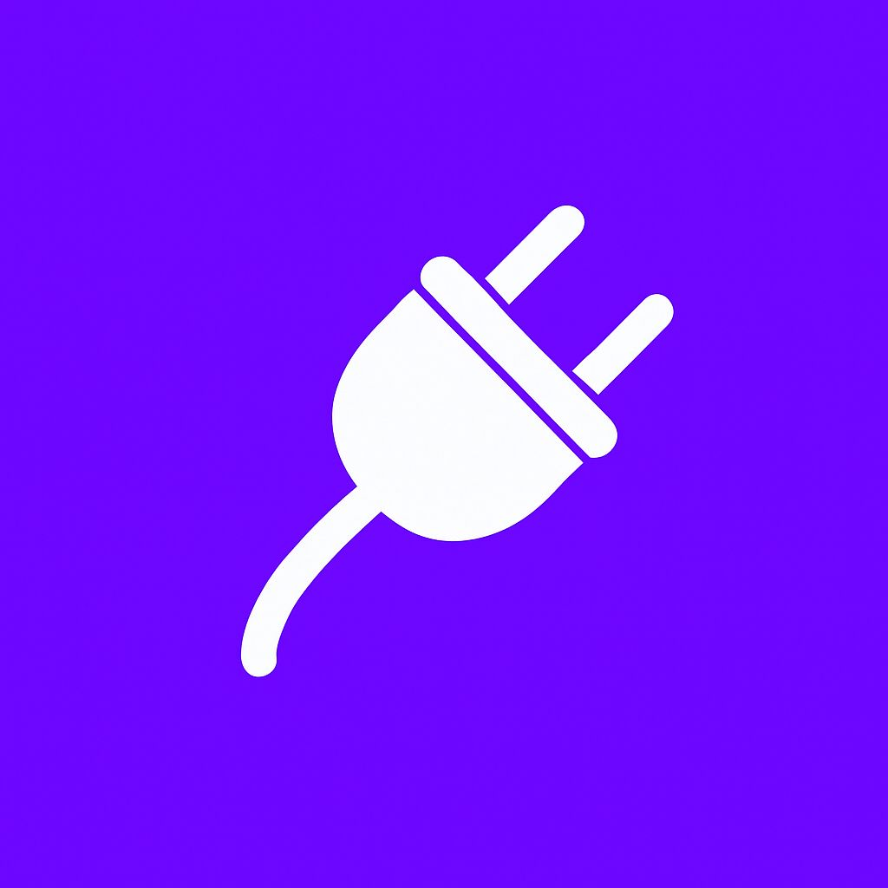

<p align="center">
  
</p>

<h1 align="center">Pluggers</h1>

<p align="center">
  <strong>Il professionista giusto, al momento giusto.</strong><br />
  La piattaforma italiana per trovare professionisti qualificati nella tua zona.
</p>

<p align="center">
  <a href="#tech-stack">Tech Stack</a> &middot;
  <a href="#getting-started">Getting Started</a> &middot;
  <a href="#project-structure">Structure</a> &middot;
  <a href="#license">License</a>
</p>

---

## Tech Stack

| Layer | Technology |
|-------|-----------|
| Framework | [Next.js 16](https://nextjs.org) (App Router) |
| Language | TypeScript 5 |
| Styling | Tailwind CSS 4 |
| Animations | Framer Motion |
| Icons | Lucide React |
| Theming | next-themes (dark / light) |

## Getting Started

```bash
# Install dependencies
npm install

# Start development server
npm run dev
```

Open [localhost:3000](http://localhost:3000) to see the landing page.

## Project Structure

```
app/
  (site)/          Landing page and blog
  api/             REST endpoints
components/        Reusable UI components
lib/               Utilities and data helpers
assets/            Static assets (logo, images)
```

## License

MIT &copy; Pluggers